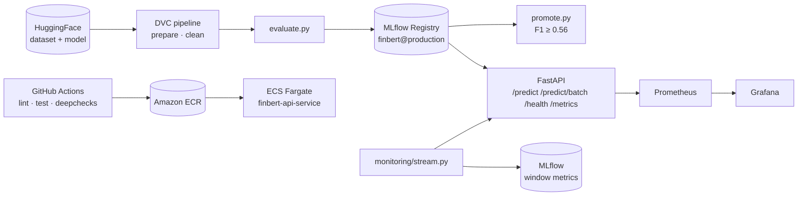

# Real-Time Financial News Sentiment Service

This project takes a pre-trained financial news sentiment model (FinBERT, `baptle/FinBERT_market_based`) and builds the MLOps stack around it:

- data versioning with **DVC**
- evaluation and a model registry with **MLflow**
- a **FastAPI** inference service
- **Docker** packaging
- **GitHub Actions** CI/CD that deploys to **Amazon ECS Fargate**
- **Prometheus/Grafana** metrics
- an **MLflow** production-monitoring stream



## Results

| Check | Result |
|---|---|
| Evaluation on 1,629 held-out headlines | accuracy 0.638 · **f1_weighted 0.590** · precision 0.611 · recall 0.638 |
| Promotion gate (`f1_threshold: 0.56`) | passed → alias `production` |
| Drift gate (test set vs. 444 cleaned Bluesky posts) | Sentiment property drift **0.404** (< 0.5) · prediction drift **0.232** (< 0.6) |
| Integration tests | 14 passed (HuggingFace and MLflow model sources) |
| Load test (Locust, 10 users, 30 s, local CPU) | 0 failures · `/predict` p50 34 ms, p95 64 ms · `/predict/batch` (4 texts) p50 130 ms |
| Image size | 11 GB → **1.8 GB** with CPU-only torch ([docs/IMAGE_SIZE.md](docs/IMAGE_SIZE.md)) |

## Project layout

```
app/main.py               FastAPI service, JSON logging, Prometheus metrics
app/utils.py              Model loading (MLflow registry or HuggingFace)
scripts/load_data.py      DVC stage "prepare" — train/test split
scripts/clean_data.py     DVC stage "clean"   — raw Bluesky stream → data/stream.csv
scripts/evaluate.py       Evaluate + log + register in MLflow
scripts/promote.py        Set the "production" alias if f1_weighted ≥ threshold
scripts/run_deepchecks.py Property (Sentiment) + prediction drift gate
scripts/rollback.py       Revert "production" to the previous version
scripts/drift_gate.sh     Drift gate + automatic rollback
scripts/locustfile.py     Load test
monitoring/stream.py      Simulated production traffic → MLflow window metrics
monitoring/grafana/       Provisioned datasource + dashboard JSON
infra/                    AWS setup / status / teardown scripts + ECS task definition
.github/workflows/        ci-cd.yml (test → build → deploy), rollback.yml
dvc.yaml / dvc.lock       Data pipeline + its lock file
params.yaml               All tunable parameters and thresholds
```

## Running it

Requires Python 3.12. On a local machine (the Udacity workspace already has the dependencies installed):

```bash
python -m venv .venv && source .venv/bin/activate
pip install torch==2.5.1 torchvision==0.20.1 --index-url https://download.pytorch.org/whl/cpu
pip install -r requirements.txt
cp .env.example .env        # MLFLOW_EXPERIMENT_NAME=finbert-evaluation, MODEL_NAME=finbert, MODEL_STAGE=production
python scripts/smoke_test.py   # downloads the model and patches its id2label config
```

> **macOS:** AirPlay Receiver listens on port 5000, so `localhost:5000` returns HTTP 403.
> Use `MLFLOW_TRACKING_URI=http://127.0.0.1:5000` in `.env`, or turn off AirPlay Receiver.

| Task | Commands |
|---|---|
| 1 · DVC | `dvc repro` (the stages read `params.yaml`; outputs are listed in `dvc.lock`) |
| 2 · MLflow | `mlflow server --port 5000 --host 0.0.0.0` then `python scripts/evaluate.py && python scripts/promote.py` |
| 3 · API | `python app/main.py` · `pytest tests/` · `locust -f scripts/locustfile.py --host http://localhost:8000` |
| 4 · Docker | `docker compose up --build` → API :8000, Prometheus :9090, Grafana :3000 (*do not run this in the Udacity workspace*) |
| 5 · CI/CD | `python scripts/run_deepchecks.py`; push to `main` (see [infra/README.md](infra/README.md)) |
| 6 · Monitoring | `python monitoring/stream.py` (with the API running) |

### API

```bash
curl localhost:8000/health
# {"status":"ok"}            (HTTP 503 while the model is not loaded)
curl -X POST localhost:8000/predict -H 'content-type: application/json' \
     -d '{"text": "Quarterly earnings beat analyst expectations by wide margin."}'
# {"text":"...","sentiment":"positive","confidence":0.598325,"latency_ms":50.656}
curl -X POST localhost:8000/predict/batch -H 'content-type: application/json' \
     -d '{"texts": ["Shares plunged after the CEO resigned.", "Stocks closed flat."]}'
```

Validation:
- Empty text, an empty list, a blank item, or more than 64 texts → **422**.
- Model not loaded → **503**.
- Texts over 2,000 characters are logged as a warning, because the model truncates them to 512 tokens.

Each log line is one JSON object: `{"timestamp", "level", "message", ...fields}`.

`/metrics` exposes:
- `prediction_requests_total{sentiment}`
- `prediction_latency_ms` (histogram)
- `prediction_errors_total`

## CI/CD

`.github/workflows/ci-cd.yml` runs on every push to `main`:

1. **lint**: `ruff` (project config in `ruff.toml`).
2. **test** and **deepchecks** run in parallel with `MODEL_SOURCE=huggingface` and the CPU-only torch wheel. pip and HuggingFace caches are reused. The model config is patched with `scripts/smoke_test.py`. The deepchecks job regenerates the data with `dvc repro`.
3. **build**: depends on both jobs. Logs in to ECR, then builds and pushes `finbert-api:<sha7>-<timestamp>` and `:latest`.
4. **deploy**: runs in the **`production` environment (manual approval gate)**. Downloads the current `finbert-api` task definition, renders the new image into it, and deploys it to `finbert-api-service` on `finbert-cluster` with `amazon-ecs-deploy-task-definition`. It waits for the service to stabilise.

The AWS resources are created by `infra/setup_aws.sh` and removed by `infra/teardown_aws.sh` (see [infra/README.md](infra/README.md)).

## Extras beyond the rubric

- **Grafana dashboard** ([monitoring/grafana/dashboards/finbert-api.json](monitoring/grafana/dashboards/finbert-api.json)), provisioned automatically by `docker compose`. Panels:
  - request rate by sentiment
  - p50/p95/p99 latency
  - sentiment share over time
  - error rate
  - KPI stats
- **Deploy approval gate**: the `deploy` job targets the GitHub `production` environment, which has required reviewers.
- **Drift rollback**: `scripts/drift_gate.sh`, `scripts/rollback.py` and `.github/workflows/rollback.yml` ([docs/ROLLBACK.md](docs/ROLLBACK.md)).
- **CPU-only production image**: `requirements-prod.txt` with `--no-cache-dir`, a non-root user, and the model baked in so the container runs offline. Measured 11 GB → 1.8 GB ([docs/IMAGE_SIZE.md](docs/IMAGE_SIZE.md)).

## Notes

- `requirements.txt` pins `numpy<2` and `transformers<4.46`: `scikit-learn 1.3` does not import with NumPy 2, and `mlflow 2.16` predates transformers 5.
- The HuggingFace model ships a broken `id2label` (float labels). `scripts/smoke_test.py` patches the cached config, and both the CI jobs and the Docker build run it.
